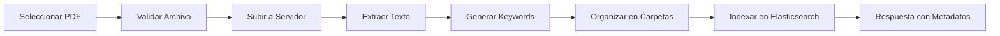

# 📚 Documentación Completa - Sistema de Subida de Hojas de Vida para Docentes

## 🎯 Resumen del Sistema

Este sistema proporciona una solución completa para la **gestión de hojas de vida de docentes** con las siguientes características principales:

- 📄 **Subida de PDFs** con extracción automática de texto
- 🔍 **Búsqueda avanzada** con Elasticsearch
- 🏷️ **Generación automática de keywords** (50+ por documento)
- 📊 **Organización por estructura de carpetas** por docente
- 🚀 **API REST completa** para integración frontend
- 📈 **Dashboard de estadísticas** y reportes

---

## 📋 Estructura de la Documentación

### 🚀 **1. [CV_UPLOAD_API.md](./CV_UPLOAD_API.md)**
**📖 Documentación Principal de la API**
- ✅ Endpoint POST `/upload` completo con ejemplos
- ✅ Parámetros requeridos y opcionales
- ✅ Estructura de respuestas JSON
- ✅ Componentes React listos para usar
- ✅ Hook `useDocumentUpload` personalizado
- ✅ Estilos CSS completos

**🎯 Úsalo para:**
- Entender cómo funciona la API
- Implementar el formulario básico de subida
- Ver ejemplos de request/response
- Integrar componentes en tu proyecto

### 🔧 **2. [CV_UPLOAD_TYPES.md](./CV_UPLOAD_TYPES.md)**
**📝 Definiciones TypeScript Completas**
- ✅ Interfaces para todos los tipos de datos
- ✅ Enums para categorías y tipos de documento
- ✅ Validadores y guards de tipo
- ✅ Utilidades de formateo y validación
- ✅ Constantes del sistema

**🎯 Úsalo para:**
- Obtener type safety completo
- Implementar validaciones robustas
- Usar utilidades pre-construidas
- Mantener consistencia en tipos

### 💼 **3. [CV_UPLOAD_EXAMPLES.md](./CV_UPLOAD_EXAMPLES.md)**
**🚀 Ejemplos Prácticos y Casos de Uso**
- ✅ Subida individual de CV
- ✅ Subida masiva (batch upload)
- ✅ Buscador avanzado con filtros
- ✅ Dashboard con estadísticas
- ✅ Componentes completos listos para usar

**🎯 Úsalo para:**
- Implementar funcionalidades específicas
- Ver patrones de uso reales
- Copiar y adaptar componentes
- Entender casos de uso avanzados

---

## 🏗️ Arquitectura del Sistema

### Backend (Ya Implementado)
```
src/
├── documents/
│   ├── documents.service.ts      # Servicio principal de documentos
│   ├── documents.controller.ts   # Controladores REST
│   └── documents.routes.ts       # Rutas del API
├── config/
│   └── elasticsearch.service.ts  # Servicio de búsqueda avanzada
└── retrieval/
    ├── retrieval.service.ts      # Servicio de recuperación
    ├── retrieval.controller.ts   # Controladores de búsqueda
    └── retrieval.routes.ts       # Rutas de recuperación
```

### Frontend (Para Implementar)
```
src/
├── components/
│   ├── CVUploadForm.tsx          # Formulario de subida
│   ├── BulkCVUpload.tsx         # Subida masiva
│   ├── CVSearchAndList.tsx      # Buscador y lista
│   └── CVDashboard.tsx          # Dashboard
├── hooks/
│   └── useDocumentUpload.ts     # Hook personalizado
├── types/
│   └── cvUpload.types.ts        # Definiciones TypeScript
└── styles/
    └── CVUpload.css            # Estilos completos
```

---

## 🚀 Guía de Inicio Rápido

### 1. **Configuración Inicial**

```bash
# Backend ya está funcionando en:
http://localhost:12345

# Endpoints principales:
POST   /api/documents/upload                    # Subir CV
GET    /api/retrieval/advanced-search          # Buscar CVs
GET    /api/retrieval/download/{id}            # Descargar CV
GET    /api/retrieval/view/{id}                # Ver CV en browser
DELETE /api/documents/{id}                     # Eliminar CV
```

### 2. **Subida Básica de CV**

```typescript
// Ejemplo mínimo para subir un CV
const uploadCV = async (file: File, teacher: TeacherData) => {
  const formData = new FormData();
  formData.append('file', file);
  formData.append('employeeUuid', teacher.uuid);
  formData.append('employeeName', teacher.name);
  formData.append('employeeCedula', teacher.cedula);
  formData.append('documentType', 'hojas-de-vida');

  const response = await fetch('http://localhost:12345/api/documents/upload', {
    method: 'POST',
    body: formData
  });

  return response.json();
};
```

### 3. **Búsqueda de CVs**

```typescript
// Buscar CVs con filtros
const searchCVs = async (query: string) => {
  const params = new URLSearchParams({
    query,
    documentType: 'hojas-de-vida',
    size: '20'
  });

  const response = await fetch(
    `http://localhost:12345/api/retrieval/advanced-search?${params}`
  );
  
  return response.json();
};
```

---

## 📊 Características del Sistema

### ✅ **Funcionalidades Implementadas**

| Característica | Estado | Descripción |
|---------------|--------|-------------|
| 📄 **Subida de PDFs** | ✅ Completo | Subida con validación y procesamiento automático |
| 🔍 **Extracción de Texto** | ✅ Completo | Automática para PDFs usando pdf-parse |
| 🏷️ **Keywords Inteligentes** | ✅ Completo | Generación automática de 50+ palabras clave |
| 📂 **Organización de Archivos** | ✅ Completo | Estructura: `/uploads/año/empleadoUUID/tipo/` |
| 🔎 **Búsqueda Elasticsearch** | ✅ Completo | Búsqueda fuzzy, filtros, agregaciones |
| 🌐 **API REST** | ✅ Completo | Endpoints para CRUD y búsqueda avanzada |
| 📱 **Componentes React** | ✅ Documentado | Listos para usar, con ejemplos completos |
| 🎨 **Estilos CSS** | ✅ Completo | Responsive, profesional, listo para producción |

### 🔄 **Flujo de Procesamiento**



### 📁 **Estructura de Carpetas Generada**

```
uploads/
└── 2025/                                    # Año actual
    └── {employeeUuid}/                      # UUID único del docente
        └── hojas-de-vida/                   # Tipo de documento
            └── 2025_1234567890_hojas-de-vida_1728576543210_cv_juan.pdf
                 ↑    ↑         ↑              ↑              ↑
                año  cedula   tipo         timestamp      nombre original
```

---

## 🎯 Casos de Uso Principales

### 🧑‍🏫 **1. Subida Individual de CV**
```typescript
// Ver: CV_UPLOAD_EXAMPLES.md - SingleCVUpload
- Formulario simple con validación
- Progress bar en tiempo real
- Manejo de errores completo
- Auto-generación de títulos y tags
```

### 📚 **2. Subida Masiva de CVs**
```typescript
// Ver: CV_UPLOAD_EXAMPLES.md - BulkCVUpload
- Selección múltiple de archivos
- Asignación de datos por docente
- Subida en lotes de 3 simultáneos
- Seguimiento de progreso individual
```

### 🔍 **3. Búsqueda y Gestión**
```typescript
// Ver: CV_UPLOAD_EXAMPLES.md - CVSearchAndList
- Búsqueda por texto libre
- Filtros por cédula, nombre, fecha
- Vista de resultados con metadata
- Acciones: ver, descargar, eliminar
```

### 📊 **4. Dashboard de Estadísticas**
```typescript
// Ver: CV_UPLOAD_EXAMPLES.md - CVDashboard
- Estadísticas generales del sistema
- Keywords más frecuentes
- Subidas recientes
- Métricas de uso
```

---

## 🛠️ Configuración y Personalización

### 📋 **Variables de Configuración**

```typescript
// Configuración por defecto
const CONFIG = {
  MAX_FILE_SIZE: 10 * 1024 * 1024,        // 10MB
  ALLOWED_MIME_TYPES: ['application/pdf'],  // Solo PDFs
  DEFAULT_DOCUMENT_TYPE: 'hojas-de-vida',   // Tipo específico
  DEFAULT_CATEGORY: 'curriculum-vitae',     // Categoría por defecto
  DEFAULT_TAGS: ['curriculum', 'docente'],  // Tags automáticos
  API_BASE_URL: 'http://localhost:12345'   // URL del backend
};
```

### 🔧 **Personalización para Otros Tipos de Documentos**

```typescript
// Para otros tipos de documentos, cambiar:
documentType: 'contratos'        // En lugar de 'hojas-de-vida'
category: 'legal'               // En lugar de 'curriculum-vitae'
tags: ['contrato', 'laboral']   // En lugar de ['curriculum', 'docente']

// El sistema automáticamente creará:
// uploads/2025/{employeeUuid}/contratos/archivo.pdf
```

---

## 🚨 Validaciones y Restricciones

### ✅ **Validaciones Automáticas**

| Campo | Validación | Mensaje de Error |
|-------|------------|------------------|
| **Archivo** | Solo PDF, máx 10MB | "Solo se permiten archivos PDF de máximo 10MB" |
| **UUID** | Formato UUID válido | "El UUID no tiene un formato válido" |
| **Nombre** | Mínimo 2 caracteres | "El nombre debe tener al menos 2 caracteres" |
| **Cédula** | 8-12 dígitos numéricos | "La cédula debe tener entre 8 y 12 dígitos" |

### 🔍 **Generación de Keywords**

```typescript
// Algoritmo inteligente que extrae:
- ✅ Palabras individuales (4+ caracteres)
- ✅ Bigramas (frases de 2 palabras)
- ✅ Trigramas (frases de 3 palabras)
- ✅ Palabras compuestas con guión
- ✅ Números con contexto (años, códigos)
- ✅ Siglas en mayúsculas
- ✅ Filtrado de stop words (español e inglés)
- ✅ Scoring TF-IDF simplificado
- ✅ Máximo 50 keywords por documento
```

---

## 🔗 URLs y Endpoints

### 📡 **Endpoints Principales**

```bash
# Subir documento
POST http://localhost:12345/api/documents/upload

# Buscar documentos
GET http://localhost:12345/api/retrieval/advanced-search?query=texto&documentType=hojas-de-vida

# Descargar documento
GET http://localhost:12345/api/retrieval/download/{documentId}

# Ver documento en browser
GET http://localhost:12345/api/retrieval/view/{documentId}

# Eliminar documento
DELETE http://localhost:12345/api/documents/{documentId}

# Buscar por keywords
GET http://localhost:12345/api/retrieval/search/keywords?keywords=educacion,experiencia

# Buscar por contenido
GET http://localhost:12345/api/retrieval/search/content?content=universidad

# Obtener sugerencias
GET http://localhost:12345/api/retrieval/suggestions?text=educ

# Buscar similares
GET http://localhost:12345/api/retrieval/similar/{documentId}
```

---

## 🎨 Implementación Frontend

### 🏗️ **Estructura Recomendada**

```typescript
// 1. Instalar dependencias
npm install axios react-router-dom

// 2. Copiar tipos de CV_UPLOAD_TYPES.md
src/types/cvUpload.types.ts

// 3. Implementar hook de CV_UPLOAD_API.md
src/hooks/useDocumentUpload.ts

// 4. Usar componentes de CV_UPLOAD_EXAMPLES.md
src/components/CVUploadForm.tsx
src/components/BulkCVUpload.tsx
src/components/CVSearchAndList.tsx
src/components/CVDashboard.tsx

// 5. Copiar estilos
src/styles/CVUpload.css
```

### 🎯 **Pasos de Implementación**

1. **Crear el proyecto React**
   ```bash
   npx create-react-app cv-management --template typescript
   cd cv-management
   ```

2. **Copiar archivos de documentación**
   - Tipos: `CV_UPLOAD_TYPES.md` → `src/types/`
   - Componentes: `CV_UPLOAD_EXAMPLES.md` → `src/components/`
   - Estilos: CSS de la documentación → `src/styles/`

3. **Configurar rutas**
   ```typescript
   // App.tsx - Ver ejemplo en CV_UPLOAD_EXAMPLES.md
   ```

4. **Personalizar según necesidades**
   - Cambiar colores en CSS
   - Ajustar validaciones
   - Añadir campos específicos

---

## 🐛 Troubleshooting

### ❌ **Problemas Comunes**

| Problema | Causa | Solución |
|----------|-------|----------|
| **"Error de CORS"** | Frontend y backend en puertos diferentes | Configurar CORS en backend o usar proxy |
| **"Archivo muy grande"** | PDF supera 10MB | Comprimir PDF o aumentar límite |
| **"UUID inválido"** | Formato incorrecto | Usar generador UUID válido |
| **"No se puede indexar"** | Elasticsearch no disponible | Verificar conexión a Elasticsearch |
| **"Keywords vacías"** | PDF sin texto | Verificar que el PDF tenga texto extraíble |

### 🔧 **Debugging**

```typescript
// Habilitar logs detallados
console.log('📄 Subiendo documento:', {
  filename: file.name,
  size: file.size,
  type: file.type,
  employeeUuid,
  employeeName
});

// Verificar respuesta del servidor
const response = await fetch(url, config);
console.log('📡 Respuesta del servidor:', await response.json());
```

---

## 🚀 Roadmap y Extensiones Futuras

### 🔮 **Funcionalidades Planificadas**

- 📊 **Reportes avanzados** con gráficos y métricas
- 🔔 **Notificaciones** de subidas y cambios
- 👥 **Gestión de permisos** por roles de usuario
- 📱 **App móvil** para subida desde dispositivos
- 🤖 **IA para análisis** automático de CVs
- 📧 **Integración con email** para notificaciones
- 🔐 **Autenticación avanzada** con OAuth2
- 📋 **Templates de CV** estandarizados

### 🎯 **Extensiones para Otros Documentos**

```typescript
// Contratos
documentType: 'contratos'
category: 'legal'
tags: ['contrato', 'laboral', 'legal']

// Certificados
documentType: 'certificados'
category: 'academico'
tags: ['certificado', 'titulo', 'academico']

// Evaluaciones
documentType: 'evaluaciones'
category: 'administrativo'
tags: ['evaluacion', 'desempeño', 'calificacion']
```

---

## 📞 Soporte y Contacto

### 🆘 **¿Necesitas Ayuda?**

1. **Revisa esta documentación completa**
2. **Consulta los ejemplos prácticos** en `CV_UPLOAD_EXAMPLES.md`
3. **Verifica los tipos TypeScript** en `CV_UPLOAD_TYPES.md`
4. **Usa los componentes listos** de `CV_UPLOAD_API.md`

### 📝 **Contribuciones**

Si encuentras bugs o quieres añadir funcionalidades:
1. Documenta el problema o mejora
2. Proporciona ejemplos de código
3. Mantén la consistencia con los tipos existentes

---

## ✅ Checklist de Implementación

### 🏁 **Para Empezar**

- [ ] ✅ **Backend funcionando** (ya implementado)
- [ ] 📋 **Leer documentación completa**
- [ ] 🔧 **Configurar proyecto React**
- [ ] 📝 **Copiar tipos TypeScript**
- [ ] 🎨 **Implementar estilos CSS**

### 🚀 **Funcionalidades Básicas**

- [ ] 📤 **Subida individual de CV**
- [ ] 🔍 **Búsqueda y listado**
- [ ] 👁️ **Visualización de documentos**
- [ ] 📥 **Descarga de archivos**
- [ ] 🗑️ **Eliminación segura**

### 📊 **Funcionalidades Avanzadas**

- [ ] 📚 **Subida masiva**
- [ ] 📈 **Dashboard de estadísticas**
- [ ] 🏷️ **Gestión de tags**
- [ ] 🔎 **Búsqueda avanzada**
- [ ] 📱 **Responsive design**

---

## 🎉 ¡Listo para Empezar!

Con esta documentación completa tienes todo lo necesario para implementar un sistema profesional de gestión de hojas de vida para docentes. 

**Archivos de documentación:**
- 📚 `README.md` (este archivo) - Guía principal
- 🚀 `CV_UPLOAD_API.md` - API y componentes principales
- 🔧 `CV_UPLOAD_TYPES.md` - Tipos TypeScript completos
- 💼 `CV_UPLOAD_EXAMPLES.md` - Ejemplos prácticos y casos de uso

¡Comienza con el archivo que mejor se adapte a tus necesidades! 🚀✨