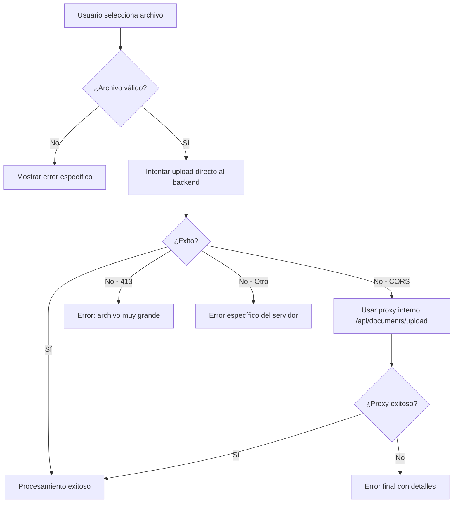

# 🚀 Soluciones a Problemas de Upload - Frontend

## 📋 Problemas Identificados y Solucionados

### 1. ❌ Error CORS (403)
**Problema**: `Access to fetch at 'https://demo-facilwhatsappapi.facilcreditos.co/api/documents/upload' from origin 'https://demo.facilcreditos.co' has been blocked by CORS policy`

**Soluciones Implementadas**:
- ✅ **API Proxy Interna**: Creada ruta `/api/documents/upload/route.ts` que actúa como proxy
- ✅ **Fallback Automático**: Si la petición directa falla por CORS, automáticamente usa el proxy
- ✅ **Headers CORS**: Configurados en `next.config.ts` y `middleware.ts`

### 2. ❌ Error 413 (Request Entity Too Large)
**Problema**: `POST https://demo-facilwhatsappapi.facilcreditos.co/api/documents/upload net::ERR_FAILED 413`

**Soluciones Implementadas**:
- ✅ **Límites Aumentados**: Configuración para archivos hasta 50MB
- ✅ **Validación Frontend**: Verificación de tamaño antes del upload
- ✅ **Manejo de Errores**: Mensajes específicos para archivos grandes
- ✅ **Runtime Configurado**: API route con `runtime = 'nodejs'` y `maxDuration = 60`

## 🔧 Archivos Modificados

### 1. `next.config.ts`
- Agregados headers CORS
- Configurado rewrite para proxy
- Optimizaciones para archivos grandes

### 2. `src/app/api/documents/upload/route.ts` (NUEVO)
- Proxy interno para evitar CORS
- Manejo de FormData para archivos grandes
- Logs detallados para debugging
- Timeout de 60 segundos

### 3. `src/hooks/useDocumentSearch.ts`
- Fallback automático: API directa → Proxy interno
- Mejor manejo de errores específicos
- Logs mejorados para debugging

### 4. `src/components/cv-upload-form.tsx`
- Validación robusta de archivos (50MB límite)
- Mensajes de error específicos
- Información de límites en la UI

### 5. `middleware.ts`
- Headers CORS para todas las rutas API
- Configuración específica para uploads

### 6. `.env.local`
- Límite de archivo actualizado a 50MB
- Variables para timeout y proxy fallback

## 🚀 Flujo de Upload Mejorado



## 🧪 Testing

### Casos de Prueba
1. **Archivo PDF válido < 50MB**: ✅ Debe subir exitosamente
2. **Archivo PDF > 50MB**: ❌ Debe mostrar error específico
3. **Archivo no-PDF**: ❌ Debe rechazar con mensaje claro
4. **CORS bloqueado**: 🔄 Debe usar proxy automáticamente
5. **Backend 413**: ❌ Debe mostrar sugerencias de compresión

### Comandos de Testing
```bash
# Reiniciar el servidor de desarrollo
npm run dev

# Verificar logs en consola del navegador
# Buscar mensajes con prefijos:
# 🚀 [DEBUG] - Información de FormData
# 🌐 [UPLOAD] - Intentos de upload
# 🔄 [PROXY API] - Uso del proxy interno
# ✅ [API SUCCESS] - Uploads exitosos
# ❌ [API ERROR] - Errores detallados
```

## 📊 Monitoreo

### Logs a Observar
- **Frontend Console**: Prefijos de debug implementados
- **Network Tab**: Status codes y response times
- **Server Logs**: Logs del proxy interno Next.js

### Métricas Importantes
- Tasa de éxito de uploads directos vs proxy
- Tiempo promedio de procesamiento
- Tamaño promedio de archivos subidos

## 🔮 Mejoras Futuras

### Backend (Recomendaciones)
1. **Configurar CORS** en el servidor backend:
   ```javascript
   app.use(cors({
     origin: ['https://demo.facilcreditos.co'],
     methods: ['GET', 'POST', 'PUT', 'DELETE'],
     allowedHeaders: ['Content-Type', 'Authorization'],
     credentials: false
   }));
   ```

2. **Aumentar límite de archivos** en el servidor:
   ```javascript
   app.use(express.raw({
     type: 'application/octet-stream',
     limit: '100mb'
   }));
   ```

3. **Configurar nginx/proxy** para archivos grandes:
   ```nginx
   client_max_body_size 100M;
   proxy_read_timeout 300;
   proxy_connect_timeout 300;
   proxy_send_timeout 300;
   ```

### Frontend
1. **Upload chunked**: Dividir archivos grandes en chunks
2. **Progress bar real**: Usar XMLHttpRequest para progreso real
3. **Retry automático**: Reintentos con backoff exponencial
4. **Compresión client-side**: PDF.js para optimizar antes del upload

## 🆘 Troubleshooting

### Error persistente 413
1. Verificar límites en nginx/proxy reverso
2. Configurar `client_max_body_size` en servidor web
3. Verificar límites en el framework backend (Express, FastAPI, etc.)

### Error persistente CORS
1. Verificar que el proxy interno esté funcionando
2. Revisar logs en `/api/documents/upload/route.ts`
3. Confirmar variables de entorno `NEXT_PUBLIC_CV_UPLOAD_API_URL`

### Uploads lentos
1. Verificar tamaño del archivo vs red
2. Considerar compresión antes del upload
3. Implementar upload chunked para archivos > 10MB

---

**Fecha**: 3 de octubre de 2025  
**Autor**: GitHub Copilot  
**Estado**: ✅ Implementado y listo para testing